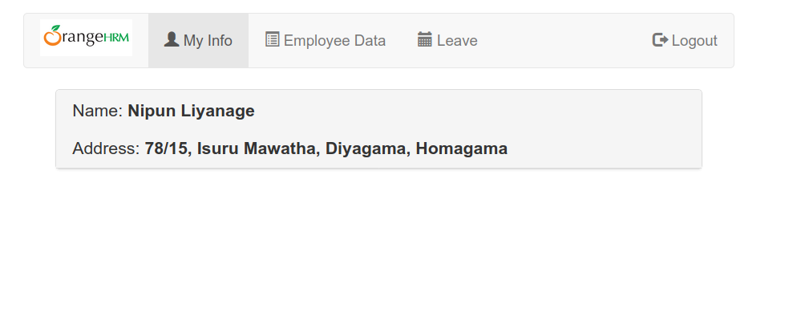

# Login App with Symfony & Angular

This is a FullStack App that combine a RESTFul API created in Symfony 3.3. In the client side, the data in managed by Angular 4, and use Bootstrap for layout.

The App contains a basic login system that allows users to login.

Looks like this:

In order to setup the app, please run this steps:

## Running the Backend:

1. Download this repo inside any Apache server instance in your computer: ... and be sure that your PHP version is >=5.5.9.
2. Inside the "db" folder you have the MySQL database dump. Create a local database and import the script in it.
3. Install Composer(in case you don't have it). 
4. Go to inside the "backend" folder and run: `Composer update` - This will download all the dependencies.
5. Edit the `backend/app/config/parameters.yml` with your local DB connection data.
6. Add privileges to your folder: "var/cache/" running: `chmod -R 777 var/cache/`
7. Now, you will have all the necessaries to run your backend, in my case the local url is like this: http://127.0.0.1/OrangeHRM/backend/web/app_dev.php/login (but it depends from your Apache setup)

Those are the services available for you: 
(In order to test all of them, use postman is a good idea)

**Login - http://127.0.0.1/OrangeHRM/backend/web/app_dev.php/login :: type POST**
Body:

*key = json
value = {"username":"admin","password":"admin"}
this will generate a token, that will be required for all the authorizations validations*

**User Details - http://127.0.0.1/OrangeHRM/backend/web/app_dev.php/user/detail/1  :: type POST**
Body:

*1 is the logged user id  
*key = authorization | value = eyJ0eXAi... (token returned by login)*

## Running the Frontend

Be sure you have installed node and npm

Go to your "frontend folder", and in the CLI type:

1. `npm install`
2. Go to your file: "frontend/src/app/services/global.ts" and update to your API endpoint.
3. `npm start`
4. Check your browser http://localhost:4200/

## Running the Unit Tests:

1. Install PHPUnit(in case you don't have it). `sudo apt-get install -y phpunit` on Linux
2. Go to inside the "backend" folder and run: `phpunit` 

